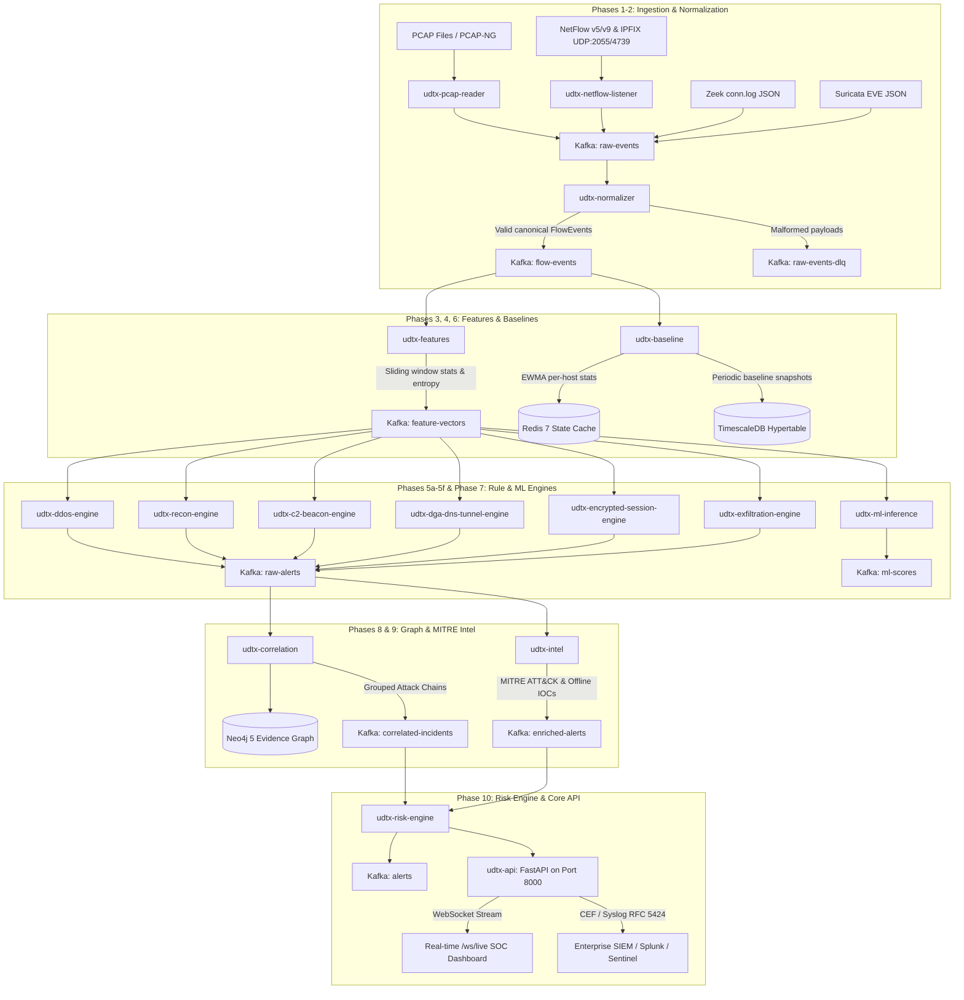

# UDT-X: Unified Defense & Telemetry Platform

> **Comprehensive End-to-End Autonomous Network Defense & Telemetry Platform**
> Built for AI-driven multi-source ingestion, canonical normalisation, real-time feature extraction, multi-class threat detection, behavioral baselines, machine learning anomaly scoring, temporal correlation, MITRE ATT&CK enrichment, dynamic risk scoring, and SIEM/SOC interoperability.

---

## 🏗️ Architecture & End-to-End Pipeline



---

## 📦 Subsystems & Delivered Components

| Subsystem | Service Name | Port / Protocol | Core Responsibility |
|---|---|---|---|
| **Pcap Ingestion** | `udtx-pcap-reader` | Native PCAP Stream | Real-time packet parsing & flow state reconstruction. |
| **NetFlow Ingestion** | `udtx-netflow-listener` | UDP `2055` / `4739` | High-throughput NetFlow v5/v9 & IPFIX decoding. |
| **Canonical Normalizer** | `udtx-normalizer` | Kafka Consumer | Schema enforcement, dead-letter routing to `raw-events-dlq`. |
| **Feature Extractor** | `udtx-features` | Kafka Stream Processor | Shannon entropy, IAT, burst rates, directional ratios. |
| **DDoS Surge Engine** | `udtx-ddos-engine` | Kafka Stream Processor | Volumetric flood, SYN surge, and protocol anomaly detection. |
| **Recon Scan Engine** | `udtx-recon-engine` | Kafka Stream Processor | Horizontal/vertical scanning & host sweep detection. |
| **C2 Beacon Engine** | `udtx-c2-beacon-engine` | Kafka Stream Processor | Autocorrelation, low-jitter periodic beaconing detection. |
| **DGA & DNS Tunnel** | `udtx-dga-dns-tunnel-engine`| Kafka Stream Processor | N-gram character entropy & base32/hex tunnel query detection. |
| **Encrypted Session** | `udtx-encrypted-session-engine` | Kafka Stream Processor | JA3 fingerprint matching, TLS cipher suite anomalies. |
| **Exfiltration Engine**| `udtx-exfiltration-engine` | Kafka Stream Processor | Asymmetric outbound volume spikes & destination novelty tracking. |
| **Behavioral Baseline** | `udtx-baseline` | Redis + TimescaleDB | 7-day Gaussian baseline models with hour-of-week seasonality. |
| **ML Inference** | `udtx-ml-inference` | ONNX Runtime | LightGBM/XGBoost classification + TreeSHAP explainability. |
| **Graph Correlator** | `udtx-correlation` | Neo4j 5 Graph DB | 30-minute sliding window multi-stage attack chain synthesis. |
| **Threat Intel** | `udtx-intel` | Local IOC Database | MITRE ATT&CK mapping & technique enrichment. |
| **Risk Engine & API** | `udtx-api` | HTTP `8000`, `/ws/live` | Dynamic composite risk scoring (0-100), REST endpoints & WebSocket. |
| **SOC Dashboard** | `udtx-dashboard` | HTTP `3001` | React 19 + TypeScript + 3D Listening Sphere mission-control cockpit. |

---

## 🏃 Quick Start Guide

### Prerequisites
- Docker & Docker Compose
- Python 3.12+ / 3.14 (with virtual environment)
- Node.js 20+

### 1. Launch Platform Infrastructure & Services
```bash
# Start all services in background
docker compose up -d

# Verify container status
docker compose ps
```

### 2. Access SOC & Management Dashboards
- **UDT-X Mission-Control Dashboard:** [http://localhost:3001](http://localhost:3001)
- **UDT-X Core API & Swagger Docs:** [http://localhost:8000/docs](http://localhost:8000/docs)
- **Redpanda Kafka Web Console:** [http://localhost:8080](http://localhost:8080)
- **Neo4j Evidence Graph Browser:** [http://localhost:7474](http://localhost:7474) (Auth: `neo4j` / `udtxpassword`)
- **TimescaleDB PostgreSQL:** `localhost:5432` (`udtx_user` / `udtx_password`)

### 3. Stream Live SOC Events
Connect to the real-time WebSocket feed:
```javascript
const ws = new WebSocket("ws://localhost:8000/ws/live");
ws.onmessage = (event) => {
    const data = JSON.parse(event.data);
    console.log("Live Security Telemetry:", data);
};
```

---

## 📜 License
Distributed under the **Apache License, Version 2.0** with full commercial warranty & enterprise SLA enablement. See [LICENSE](LICENSE) and [TERMS_AND_CONDITIONS.md](TERMS_AND_CONDITIONS.md) for details.
