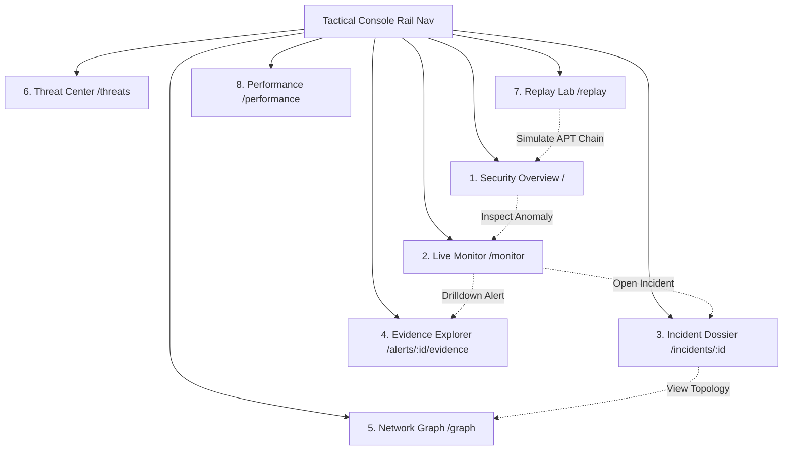

# 🎨 UDT-X SOC Dashboard: Frontend Design System (DESIGN.md)

**System:** Mission-Control Tactical SOC Instrumentation System  
**Version:** 1.0.0  
**Target Environment:** Tier-1 SOC / SIGINT / Critical Infrastructure Monitoring  
**Design Thesis:** Passive, read-only network monitoring via data-diode enclave with zero return path.

---

## 1. Design Philosophy & Aesthetic Thesis

UDT-X is not a generic marketing SaaS analytics dashboard with dark mode toggled on. It is engineered as mission-critical instrumentation for SOC analysts operating across continuous shifts.

### Core Tenets
1. **The Passive Listening Post:** The platform operates strictly as an inward receiver—traffic flows in one direction only.
2. **Cold Instrumental Restraint:** The visual interface defaults to calm, deep abyss hues. Vibrant colors (`accent-critical`, `accent-warn`) are never used decoratively—they only activate when backed by actual severity telemetry.
3. **Information Density & Legibility:** Technical metadata (IP addresses, hashes, flow IDs, latency metrics) is rendered in high-legibility monospace fonts (`JetBrains Mono`) to feel like authentic military/defense avionics.
4. **Accessible Performance:** Complex 3D visualizations gracefully degrade for accessibility (`prefers-reduced-motion`) and low-spec hardware without breaking analyst workflows.

---

## 2. Color Palette & Design Tokens

Derived strictly from the mission-control token table:

```css
:root {
  /* Surface Layers */
  --bg-abyss: #0B1220;          /* Deep instrument-panel navy app background */
  --bg-panel: #131B2E;          /* Glassmorphic panel base surface */
  --bg-panel-raised: #1B2540;   /* Active / hovered panel state */

  /* Sonar & Signal Colors */
  --accent-signal: #3FC7D4;      /* Cold sonar-ping cyan (ambient pulses, idle states) */
  --accent-warn: #FF8A3D;        /* Medium-severity alerts & caution indicators */
  --accent-critical: #FF4757;    /* High/Critical severity only (hot dominant signal) */
  --accent-confirmed: #4CAF7D;   /* Resolved / benign / nominal SLA states */

  /* Typography Colors */
  --text-primary: #E7ECF5;       /* Primary telemetry readouts & headings */
  --text-muted: #8A95AA;         /* Secondary labels, metadata & timestamps */
}
```

### Usage Matrix

| Token | Hex | Role & Constraint |
|---|---|---|
| `bg-abyss` | `#0B1220` | Root background. Never pure `#000000` or washed-out gray. |
| `bg-panel` | `#131B2E` | Container cards with `backdrop-filter: blur(12px)` and subtle cyan borders. |
| `bg-panel-raised` | `#1B2540` | Hover states and active navigation items. |
| `accent-signal` | `#3FC7D4` | Ambient radar sweeps, healthy status pings, and nominal data diode indicators. |
| `accent-warn` | `#FF8A3D` | Medium severity alerts and elevated baseline variances ($>2.0\sigma$). |
| `accent-critical` | `#FF4757` | High/Critical alerts, active attack chains, and severe baseline spikes ($>3.0\sigma$). |
| `accent-confirmed` | `#4CAF7D` | Confirmed nominal operations, passing SLAs, and active sensor connections. |

---

## 3. Typography Hierarchy

| Role | Font Family | Example Elements | Characteristics |
|---|---|---|---|
| **Display & KPI Numbers** | `Space Grotesk` | Dashboard page titles, primary KPI numerical values | Technical, engineered character; high impact; uppercase tracking. |
| **UI Controls & Body Text** | `Inter` | Descriptions, button labels, navigation titles, tooltips | Neutral, dense-data legibility, clean line heights. |
| **Instrument Data Readouts** | `JetBrains Mono` | IPs, Flow IDs, Hash values, Timestamps, SHAP scores, Risk ratings | Fixed-width precision, strict alignment, military telemetry feel. |

---

## 4. Signature Components

### 4.1 The Listening Sphere (`ListeningSphere.tsx`)
A 3D translucent wireframe perimeter built in **React Three Fiber (R3F) & Three.js**:
- **One-Way Inward Particle Flow:** Particles travel along orbital arcs **strictly inward toward the center**, embodying the data-diode thesis.
- **Node Status Highlights:** Monitored hosts on the sphere glow dynamically in `#FF4757` (Critical), `#FF8A3D` (Warn), or `#3FC7D4` (Nominal).
- **Dual Scale Deployments:**
  - *Ambient Scale (Security Overview):* Non-interactive, low particle density, calm background pulse.
  - *Full Interactive Scale (Network Graph):* Full particle density with OrbitControls (pan/orbit/zoom) and node inspection.
- **Accessibility Fallback:** Automatically replaces the WebGL canvas with an SVG sonar ring when `prefers-reduced-motion: reduce` is detected.

### 4.2 D3 Radial Sonar Sweep (`SonarRadialChart.tsx`)
Custom radial visualization in **D3.js** for the Threat Center:
- Concentric sonar distance rings ($25\%$, $50\%$, $75\%$, $100\%$).
- Polar coordinate wedge arcs sized by alert volume and colored by composite risk score.
- Interactive segment drilldown updating live forensic profile panes.

### 4.3 Left Console Rail (`App.tsx`)
- Persistent tactical sidebar navigation.
- Live Data Diode status indicator displaying connection state (`ONLINE` / `LISTENING`).
- Instant keyboard navigable tabs across all 8 analyst screens.

---

## 5. Screen Inventory & Flow



1. **Security Overview:** Real-time throughput gauge (124,850 EPS), 4 KPI cards, ambient Listening Sphere, dynamic SVG composite risk posture ring (0-100), and 7-engine cluster status.
2. **Live Monitor:** Filterable telemetry feed (by Threat Class, Severity, IP) with zero-refresh WebSocket updates.
3. **Incident Dossier:** Chronological multi-stage attack timeline, MITRE technique tags, and "Why These Were Grouped" correlation reasoning.
4. **Evidence Explorer:** Labeled mathematical evidence meters and signed **TreeSHAP local feature attribution** waterfalls.
5. **Network Graph:** Full-screen interactive 3D Listening Sphere with Cytoscape.js topology inspection.
6. **Threat Center:** Custom D3 Radial Sonar Sweep breakdown and time-range analytics (1h, 24h, 7d, 30d).
7. **Replay Lab:** Physical hardware-style toggle switches and trigger controls for live SIH demonstration presets.
8. **Performance:** Recharts throughput area charts, latency percentile trackers (P99 / Median), and container resource metrics.

---

## 6. Motion, Accessibility & Performance Standards

- **Motion Restraint:** No generic spinning loaders or bouncing UI elements. Animations are limited to slow ambient sphere rotation, discrete sonar pulses, and smooth entry transitions.
- **Colorblind-Safe Redundancy:** Severity levels are always reinforced by textual badges (`CRITICAL`, `HIGH`, `MED`, `LOW`) and distinct icons, never relying solely on color.
- **Target Frame Rate:** Steady **60 FPS** on the 3D Listening Sphere with bounded particle buffers and automatic garbage collection on unmount.
