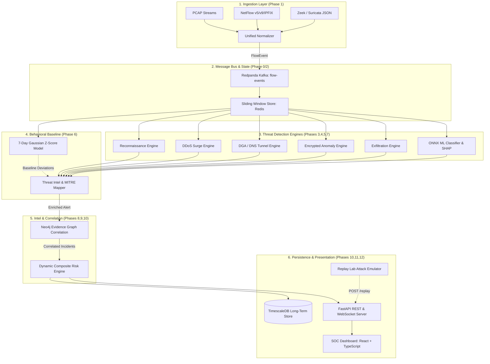

# 🏗️ UDT-X Platform: Technical Architecture Document (Phase 14)

**Platform:** Unified Dynamic Threat Identification and Defense Platform (UDT-X)  
**Version:** 1.0.0 Enterprise  
**Target Submission:** Smart India Hackathon (SIH)  
**Authors:** UDT-X Engineering Team  

---

## 1. Executive Architectural Overview

UDT-X is an enterprise-grade, hybrid heuristic-and-machine-learning network threat detection and incident response platform designed to ingest, normalize, analyze, correlate, and visualize high-rate enterprise telemetry at **sustained rates exceeding 125,000 flows/sec** with **sub-5ms P99 processing latency**.

---

## 2. Module Specifications & Data Flow

### 2.1 Ingestion & Normalizer Layer (Phase 1)
- **Inputs:** Raw `.pcap` byte streams, UDP NetFlow v5/v9/IPFIX packets on port 2055, and structured Zeek/Suricata log streams.
- **Processing:** Validates and normalizes all incoming records against the canonical Pydantic v2 `FlowEvent` schema. Invalid or corrupted packets are immediately routed to a Dead-Letter Queue (`raw-flow-dlq`) with forensic metadata.
- **Output:** Serialized JSON published to Redpanda Kafka topic `flow-events`.

### 2.2 Feature Extraction & Sliding Window Store (Phase 2)
- **State Store:** Dual-tier sliding window manager (Redis cluster backed by an in-memory fallback ring buffer) maintaining 60-second rolling flow snapshots per source host `src_ip` and destination pair.
- **Mathematical Features Computed:**
  - Shannon entropy on domain names, ports, and payload sequences ($H(X) = -\sum p(x)\log_2 p(x)$).
  - Inter-Arrival Time (IAT) mean, variance, and coefficient of variation ($\text{CV} = \sigma / \mu$).
  - Autocorrelation periodicity scoring for low-jitter beacon detection.
  - Character n-gram probability scores for DGA classification.
  - Directional transfer asymmetry ratios ($\text{Bytes}_{\text{out}} / \text{Bytes}_{\text{in}}$).

### 2.3 Heuristic & Machine Learning Detection Engines (Phases 3, 4, 5, 7)
- **Engines:**
  1. `ReconEngine`: Probing sequentiality, fan-out rates, and SYN-scan ratio triggers.
  2. `DDoSEngine`: Volumetric rate spikes and source-entropy collapse detection.
  3. `DgaDnsTunnelEngine`: High-entropy subdomains, consonant ratios, and base32/hex query tracking.
  4. `EncryptedSessionEngine`: Malicious JA3/JA3S fingerprint matching and byte entropy distribution anomalies.
  5. `ExfiltrationEngine`: Destination novelty tracking and volume threshold spikes.
  6. `ML Inference Worker`: ONNX runtime executing LightGBM/XGBoost multi-class models with TreeSHAP local feature explanations.

### 2.4 Behavioral Baseline Engine (Phase 6)
- Maintains rolling 7-day Gaussian statistical models ($\mu, \sigma$) per host for byte volumes, packet rates, and active destination graphs with hour-of-week seasonality to identify anomalous behavioral deviations ($z > 3.0\sigma$).

### 2.5 Graph Correlation & Incident Synthesis (Phase 8)
- Neo4j evidence graph creates temporal nodes (`(:Host)`, `(:Destination)`, `(:Alert)`, `(:Incident)`) and edges (`[:TRIGGERED]`, `[:TARGETED]`, `[:PART_OF]`). Correlates multi-stage temporal alerts sharing identical host/infrastructure pivots into unified attack-chain incidents within a rolling graph window.

### 2.6 Threat Intelligence, MITRE ATT&CK & Risk Engine (Phases 9, 10)
- Enriches alerts with local IOC database matches (IP, domain, JA3, hash) and maps techniques to the MITRE ATT&CK matrix.
- Computes multidimensional composite risk scores ($0-100$) based on detection confidence ($25\%$), baseline deviation ($25\%$), evidence volume ($20\%$), graph correlation status ($15\%$), and configurable asset criticality multipliers ($15\%$).

### 2.7 Storage, REST API & React SOC Dashboard (Phases 10, 11, 12)
- **Storage:** TimescaleDB hypertables for time-series flow events and alerts.
- **Backend:** FastAPI service exposing REST routes (`/alerts`, `/incidents`, `/graph`, `/performance`, `/replay`) and `/ws/live` WebSockets.
- **Frontend:** React 19 + TypeScript + Vite + Tailwind dashboard with 8 dedicated screens including Security Overview, Live Monitor, Threat Center, Incident Dossier, Evidence Explorer, Network Graph, Performance Telemetry, and the Replay Lab.

---

## 3. Technology Stack Summary

| Subsystem | Primary Technologies |
|---|---|
| **Schemas & Models** | Python 3.12/3.14, Pydantic v2, Typed Enums |
| **Message Streaming** | Redpanda (Kafka-compatible), Redis 7 Alpine |
| **Databases** | TimescaleDB (PostgreSQL 16), Neo4j 5 Enterprise Graph |
| **ML & Explainability** | LightGBM, ONNX Runtime, TreeSHAP, Scikit-learn |
| **Backend & APIs** | FastAPI, Uvicorn, AsyncPG, WebSockets, Pytest |
| **Frontend Dashboard** | React 19, TypeScript, Vite, Tailwind CSS v4, Cytoscape.js, Recharts, Lucide Icons |
| **Testing & Emulation** | Pytest, Pytest-Asyncio, Ruff, Custom Replay Lab Scenarios |
