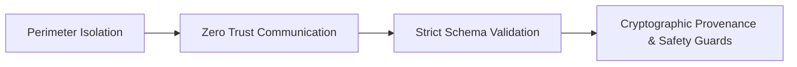

# 🛡️ UDT-X Security & Threat Model (One-Page Executive Summary)

**Document Reference:** Ideation Document Section 16 & Section 26.9  
**Scope:** UDT-X Platform Architecture & Deployment Perimeter  
**Classification:** Security Architecture Specification  

---

## 1. Threat Landscape & Adversarial Model

UDT-X operates as a Tier-0 Network Security Monitoring and Threat Detection system. It is designed to defend against adversaries attempting:
1. **Detection Evasion:** Slow-and-low port scans, pseudo-random DGA domain fluxing, encrypted TLS payload tunneling, and low-jitter periodic C2 beaconing.
2. **Resource Exhaustion & Denial of Service:** High-volume volumetric SYN/UDP floods aiming to degrade pipeline throughput and blind SOC sensors.
3. **Data Poisoning & Adversarial ML Evasion:** Manipulated flow feature vectors attempting to exploit statistical decision boundaries.
4. **Sensor Compromise & Spoofing:** Injected synthetic flow telemetry or unauthorized API/WebSocket stream access.

---

## 2. Core Security & Trust Pillars (Section 16)

- **Zero-Trust Inter-Service Communication:** All internal Docker microservices communicate across isolated, non-public container network bridges. External exposure is strictly limited to authenticated API/Dashboard endpoints.
- **Fail-Open / Dead-Letter Isolation:** Unparseable, corrupted, or schema-violating flow payloads are automatically isolated into dead-letter queues (`raw-flow-dlq`) with forensic logs, preventing ingestion stalls.
- **Explainability as a Defense (TreeSHAP):** Every ML inference prediction is accompanied by exact SHAP feature contribution attributions, preventing black-box adversarial deception and ensuring transparent analyst verifiability.

---

## 3. Defense-in-Depth Hardening Specifications (Section 26.9)

| Hardening Vector | Implementation in UDT-X | Threat Mitigated |
|---|---|---|
| **Input Validation** | Strict Pydantic v2 strict models (`extra="forbid"`) with IP address format and RFC-compliant range verification. | Packet injection, buffer overflows, format string vulnerabilities. |
| **Lab Execution Guard** | `replay_lab/safety.py` enforcing execution exclusively on loopback (`127.0.0.1`) and isolated subnets; shuts down on `eth0`/`enp3s0`. | Accidental packet emission or attacks targeting production infrastructure during evaluations. |
| **State Sanitization** | Automatic sliding-window eviction with TTL in Redis and bounded memory deques in fallback mode. | Memory leakage and algorithmic state exhaustion attacks. |
| **Graph Query Sanitization** | Parameterized Cypher queries for Neo4j evidence graph lookups. | Cypher / Graph injection vulnerabilities. |
| **API Precedence & CORS** | Static endpoint priority routing and locked-down CORS policies for the React frontend. | Path traversal, parameter pollution, and cross-site scripting (XSS). |
| **Database Segmentation** | Read-only analytic queries where possible and separate TimescaleDB connection pools. | Database lock contention and unauthorized schema modifications. |

---

## 4. Compliance & Audit Readiness

- **MITRE ATT&CK Mapping:** All detected alerts are systematically tagged with technique IDs (`T1046`, `T1498`, `T1071.004`, `T1568.002`, `T1573.002`, `T1048`).
- **SIEM Export Compliance:** Standardized Common Event Format (CEF) and Syslog RFC-5424 export endpoints (`GET /alerts/export`) ready for enterprise integration.
- **Reproducibility:** Machine-readable ground-truth JSON files generated alongside every simulation run for forensic validation.
